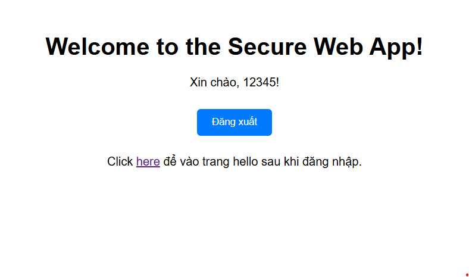

# PTUDDN-SecureWeb

## Tổng quan
Dự án này là một demo về bảo mật ứng dụng web sử dụng Spring Boot và Spring Security. Nó bao gồm các tính năng xác thực và ủy quyền cơ bản, với một kho người dùng trong bộ nhớ đơn giản.

## Tính năng
- Xác thực và ủy quyền cơ bản
- Trang đăng nhập tùy chỉnh
- Kho người dùng trong bộ nhớ
- Giao diện sử dụng Thymeleaf

## Yêu cầu
- Java 17
- Maven hoặc Gradle

## Cài đặt
1. Clone repository:
    ```sh
    git clone https://github.com/DatPhan06/PTUDDN-SecureWeb.git
    cd PTUDDN-SecureWeb
    ```

2. Build dự án sử dụng Maven:
    ```sh
    mvn clean install
    ```

3. Chạy ứng dụng:
    ```sh
    mvn spring-boot:run
    ```

## Sử dụng
- Truy cập ứng dụng tại `http://localhost:8080`
- Đăng nhập với thông tin sau:
    - Tên đăng nhập: `user`
    - Mật khẩu: `password`

## Demo
- Trang chủ:
    
- Sau khi ấn vào nút click, đến trang đăng nhập:
    
- Trang đăng nhập:
    
- Trang chào:
    

## Cấu trúc dự án
- `src/main/java/com/example/securingweb/`: Các file nguồn Java
- `src/main/resources/templates/`: Các template Thymeleaf
- `src/main/resources/static/img/`: Hình ảnh cho demo
